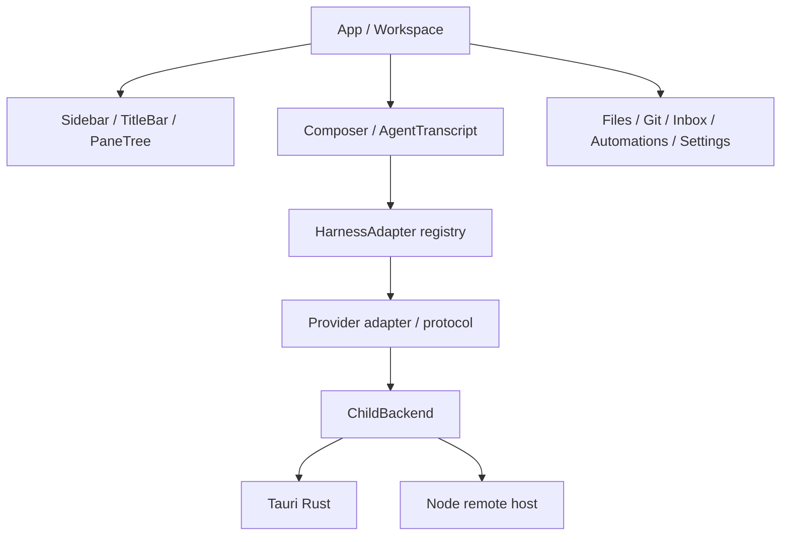
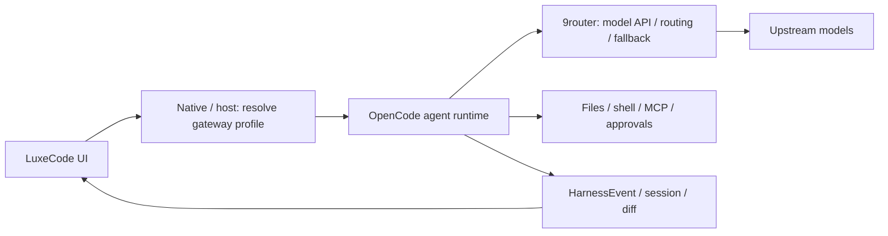

# LuxeCode: đánh giá dự án, định hướng và tích hợp 9router

Ngày đánh giá: 03/10/2026, giờ Việt Nam. Skill: `universal-source-code-review`.

## 1. Phát hiện cần xử lý trước

Các mức P1/P2 dưới đây thể hiện ưu tiên phát triển và phát hành. Những nhận xét về kiến trúc là rủi ro bảo trì, không phải lỗi runtime đã tái hiện.

### P1 — Bộ cài remote host vẫn tải sản phẩm upstream

[remote_ssh.rs:401](../src-tauri/src/remote_ssh.rs:401) dựng URL tải host từ `hardbeat920/monocode`, lấy version của ứng dụng hiện tại. Khi LuxeCode có phiên bản/protocol riêng, setup có thể tải nhầm host hoặc gặp 404 vì upstream không có tag đó. Các link tải trong [README.md:36](../README.md:36) và fallback của [updater.ts:93](../src/app/model/updater.ts:93) cũng còn trỏ MonoCode.

Hành động: tạo release host và endpoint cập nhật của LuxeCode, kiểm tra tương thích protocol, thử cài sạch và nâng cấp trên từng OS được hỗ trợ. Chặn phát hành remote cho đến khi desktop và host cùng kênh release.

### P1 — Fork chưa có định danh ứng dụng riêng

[tauri.conf.json:3](../src-tauri/tauri.conf.json:3) vẫn dùng `MonoCode` và `com.monocode.desktop`; package/crate, host service và đường dẫn dữ liệu cũng giữ tên upstream. Nếu phân phối riêng, định danh này có thể khiến hai bản dùng chung vị trí dữ liệu hoặc gây nhầm lẫn khi cài đặt. Đây là blocker của việc phát hành fork, không phải lý do sửa toàn bộ namespace ngay lập tức.

Hành động: đổi product name, bundle identifier, icon, service và release URL; quyết định rõ cách import dữ liệu cũ. Giữ MIT copyright/NOTICE của upstream. Không đổi hàng loạt các key lưu trữ trước khi có migration.

Lưu ý: updater có pubkey rỗng/endpoints rỗng trong config nguồn, nhưng workflow release có bước inject và kiểm tra cấu hình ký. Không kết luận từ đó rằng updater hiện nhận bản cập nhật không có chữ ký.

### P2 — Composition root quá lớn, làm tăng chi phí thêm gateway

[App.tsx:924](../src/app/App.tsx:924) chứa workspace composition, session lifecycle, queue, persistence và nhiều thao tác sản phẩm. File có 11.603 dòng. `SettingsView.tsx` có 4.383 dòng; `AgentTranscript.tsx` 3.855; `Sidebar.tsx` 3.776; `fs.rs` 8.610, gồm cả test.

Hệ quả: cấu hình gateway rất dễ lan sang trạng thái composer, session, restore, account và remote; sửa một nơi có thể làm lệch nơi khác. Độ dài không tự chứng minh bug hay chậm, nhưng là bằng chứng coupling cần giảm.

Hành động: tách từng phần đang cần thay đổi, ưu tiên submission/lifecycle và cấu hình provider; giữ nguyên contract `HarnessAdapter`. Không viết lại ứng dụng hoặc thêm state framework chỉ để chia file.

### P2 — Bridge spawn hiện chưa nhận cấu hình gateway riêng theo session

[child.ts:294](../src/integrations/harness/core/child.ts:294) nhận command, args, cwd, account và binary provider; [harness.rs:823](../src-tauri/src/harness.rs:823) có contract tương ứng. OpenCode đang đọc cấu hình CLI của người dùng. [harness.rs:1035](../src-tauri/src/harness.rs:1035) còn chủ động xóa một số env API key khi chọn profile Claude/Codex riêng.

Hệ quả: export env trong terminal chưa chắc áp dụng cho app mở từ Dock/service; sửa config CLI mặc định tác động cả CLI ngoài LuxeCode; chọn account khác có thể làm key/env gateway không còn hiệu lực.

Hành động: thêm một `gatewayProfileId` khi thực sự triển khai. Native/host tra profile, xác thực endpoint và cấp cấu hình cho child. Dùng cùng profile cho catalog probe, phiên agent và text generation phụ. Không cho renderer truyền một map env tùy ý.

### P2 — Secret local hiện bảo vệ bằng quyền file, chưa có keychain thống nhất

[remote-access.md:69](../docs/remote-access.md:69) xác nhận device token được lưu ở native store với mode 0600 trên Unix, chưa dùng OS keychain. Linear/Jira dùng [linear.rs:713](../src-tauri/src/linear.rs:713) và [jira.rs:935](../src-tauri/src/jira.rs:935) để ghi secret file.

Đây là giới hạn của mô hình lưu secret khi thiết bị/backup bị đọc, không phải bằng chứng token đang lộ trên mạng. Gateway sẽ thêm secret mới nên cần lưu key native, không đưa vào transcript, workspace snapshot, log hoặc localStorage. Nên dùng OS credential store cho key mới và có lộ trình migrate secret cũ; host dùng secret file/ACL thuộc tài khoản service phù hợp.

### P2 — Không dùng thao tác “Apply OpenCode settings” của 9router như API tích hợp an toàn

Trong source 9router đã kiểm tra, route `src/app/api/cli-tools/opencode-settings/route.js:109` parse config cũ bằng `JSON.parse`, catch rồi tiếp tục với `{}`, sau đó ghi lại file. Một config JSONC hợp lệ cho OpenCode nhưng có comment/trailing comma có thể mất phần cấu hình khác khi bấm Apply. Route cũng gán khả năng input text/image cho tất cả model được thêm.

Đây là phát hiện static ở dependency, chưa chạy route thật. LuxeCode nên tạo overlay riêng hoặc parse JSONC đúng nếu phải sửa config; khi đọc lỗi phải dừng ghi, backup trước và ghi atomically. Chỉ quảng bá vision khi đã kiểm tra model/route tương ứng. Không gọi endpoint quản trị 9router để sửa CLI config người dùng tự động.

### P2 — Dependency và performance còn việc cần làm

`npm audit` báo 3 dependency entries: `vitest` và `@vitest/mocker` mức moderate, `dompurify` mức low. Hai entries Vitest cùng advisory, không phải hai lỗi độc lập. Chưa có high/critical. DOMPurify advisory cần điều kiện `IN_PLACE`/hook cụ thể; chưa chứng minh ứng dụng có đường khai thác đó.

Production build pass nhưng cảnh báo chunk >500 kB: chunk Mermaid khoảng 2,30 MB, `index.esm` khoảng 1,13 MB; toàn bộ assets khoảng 19,52 MiB. Nhiều phần đã lazy-load, nên tổng asset không bằng lượng tải hoặc RAM lúc mở app.

Hành động: cập nhật dependency có kiểm soát, chạy regression suite; đo startup, tab switching, memory và transcript dài trước khi tối ưu thêm. Không dùng `npm audit fix --force` như cách sửa mặc định.

## 2. Phạm vi và bằng chứng

| Nội dung | Snapshot/phạm vi |
| --- | --- |
| Repo | https://github.com/nguyentrunghieutcu/luxecode |
| Local | `<REPO_ROOT>` |
| Commit | `00d68d342eff3adf23a320fa5e2be97d5e212683`, branch `main` |
| Nguồn gốc | GitHub API xác nhận fork của `hardbeat920/monocode` |
| Version nguồn | MonoCode 0.7.0 |
| 9router được hiểu là | `decolua/9router`, commit `a99cf57239ff778b61e434c2786009d5ed1c412c`, package 0.5.95 |
| Người dùng giả định | Developer cá nhân và nhóm nhỏ, giữ source code tại máy hoặc host do mình quản lý |
| Cách đánh giá | Đọc cấu trúc, các đường chạy chính, source gateway, test/build/audit; không đọc thủ công từng dòng toàn repo |
| Giới hạn | Chưa chạy desktop GUI, chưa gọi model thật qua 9router, chưa pentest, chưa kiểm tra release ký trên cả ba OS |

Stack: Tauri 2 + Rust, React 19 + TypeScript strict + Vite 7 + Tailwind 4; CodeMirror và xterm; SQLite local; Node.js host sử dụng `node:sqlite`.

Đây là desktop workbench cho coding agent: Claude, Codex, Cursor, Grok, OpenCode, Antigravity, Pi, omp, fx, Hermes. Repo không chỉ là UI template. Tuy nhiên README tự xác định còn rất sớm và có thể có bug. Chưa thấy định vị LuxeCode riêng trong tài liệu hiện tại.

Đã đo: 926 file TS/TSX trong `src` gồm 395 file test; 257.564 dòng tính cả test. Rust có 47 file, 45.434 dòng tính cả test inline. Host có 38 file TS, 9.575 dòng, gồm 20 file test. Không dùng số dòng/test như chứng minh chất lượng tuyệt đối.

## 3. Kết quả kiểm tra thực tế

| Kiểm tra | Kết quả |
| --- | --- |
| `npm ci --no-audit --no-fund` | Pass, 422 packages |
| `npm run check:web` | Pass: 393 file test pass, 2 skip; 4.167 test pass, 13 skip; `tsc --noEmit` pass |
| `npm run test:host` | Pass cả host build/typecheck; 19 file pass, 1 skip; 93 test pass, 5 skip |
| `npm run build` | Pass; có cảnh báo chunk size |
| `cargo test --locked` | Pass: 533 test, 1 ignored; binary/doc-test không có test |
| `cargo fmt --check` | Không chạy được vì toolchain local thiếu `rustfmt` |
| `cargo clippy --workspace --all-targets -- -D warnings` | Không chạy được vì toolchain local thiếu `clippy` |
| `npm audit --json` | 2 moderate entries, 1 low; không có high/critical |

Tổng số test pass: 4.793. Các bài test sử dụng fake provider/process hoặc happy-dom không thay thế nghiệm thu CLI/model thật và desktop native. Không gọi kết quả này là full CI pass vì fmt/clippy chưa được xác minh local. Không cài thêm Rust component trong lần audit này.

## 4. Rubric đầy đủ: 72/100

Điểm là đánh giá của snapshot và phạm vi trên, không phải SLA hoặc chứng nhận production.

| Tiêu chí | /10 | Lý do và bằng chứng |
| --- | ---: | --- |
| Kiến trúc | 7 | Adapter registry và child backend chia desktop/host khá tốt; core còn import trực tiếp domain session và composition root quá lớn (`core/registry.ts`, `core/child.ts`, `App.tsx`) |
| Cấu trúc thư mục | 8 | `features`, `integrations`, `platform`, `shared` rõ; test đặt gần chức năng, Rust chia module theo việc (`CONTRIBUTING.md`) |
| Chất lượng code | 6 | TS strict, parser/protocol tách được; nhiều file và workflow lớn, contract/env còn provider-specific (`tsconfig.json`, `harness.rs`) |
| UI/UX | 8 | Tokens, theme, container rules, keyboard/modal states và test; ảnh repo cho thấy workspace/split panes rõ. Chỉ đánh giá source và ảnh có sẵn, chưa kiểm nghiệm native/a11y toàn diện (`styles/index.css`, `SettingsView.test.ts`) |
| State management | 7 | Queue theo session, event normalization, restore/persistence có test; ownership ở App nhiều ref/state, dễ tăng coupling (`sessionStore.ts`, `core/registry.ts`) |
| Performance | 7 | Có lazy surfaces, batch stream, transcript pooling và catalog cache; build nhiều chunk lớn, chưa có baseline native (`harnessFlush.ts`, `TranscriptPool.tsx`, `host/server.ts`) |
| Security | 7 | CSP, sanitize Markdown, binary validation, remote auth/origin guard, token hash; secret storage cần nâng cấp, chưa có threat assessment cho gateway (`tauri.conf.json`, `AgentMarkdown.tsx`, `host/server.ts`, `host/store.ts`) |
| Testing & DX | 9 | 4.793 test pass, web/host/Rust đều có kiểm tra, CI matrix đa OS; runtime gateway và release của fork chưa nghiệm thu (`.github/workflows/ci.yml`, scripts package) |
| Mở rộng & scalability | 6 | Thêm backend model qua harness sẵn có khả thi; contract spawn, routing provenance và multi-tenant chưa đầy đủ. Chấm theo khả năng mở rộng sản phẩm desktop, không đòi microservices |
| Documentation | 7 | Setup, contribution, remote limitations, release docs hữu ích; branding/upstream links chưa cập nhật, thiếu kiến trúc/roadmap LuxeCode (`README.md`, `docs/remote-access.md`) |
| **Tổng** | **72/100** | **Nền tảng kỹ thuật tốt để phát triển alpha; cần hoàn tất fork và thu hẹp coupling trước khi mở rộng. Không khuyến nghị rewrite.** |

## 5. Luồng hiện tại

### Component flow



### Data flow

Local: prompt + model + permission → preparation/submission → `HarnessAdapter.sendTurn` → child CLI → protocol map thành `HarnessEvent` → batch apply vào session → render transcript và persist SQLite. Khi mở lại, app restore session và bind provider session ID; provider tự quản history/tool execution.

Remote: desktop native giữ device token → RPC qua SSH tunnel hoặc HTTPS → host xác thực token, protocol và environment ID → `HostEngine` chạy cùng adapter qua `HostChildBackend` → store snapshot/revision/event/receipt → desktop nhận snapshot/delta. Command receipts giúp tránh gửi lại prompt vì mất response; không chứng minh mọi upstream model call có exactly-once.

### User flow

Mở project → chọn harness/model/permission và checkout/worktree → gửi prompt → agent yêu cầu approval/question khi cần → người dùng xử lý → xem transcript/diff → review/test → commit/PR nếu người dùng yêu cầu. Inbox, plan, automation và orchestration mở rộng luồng này; remote vẫn thiếu một số tính năng như terminal, file mentions và skills theo tài liệu.

## 6. Mục tiêu và hướng phát triển

Mục tiêu hiện tại từ README: một desktop UI sử dụng coding agent và tài khoản người dùng đã có. Mục tiêu LuxeCode đề xuất: **một workspace để chạy, kiểm soát và review công việc của nhiều agent, với lựa chọn model và chi phí minh bạch**.

Khách hàng đầu tiên nên là developer cá nhân/power user dùng nhiều agent; sau khi ổn định mới mở nhóm nhỏ có host riêng. Giá trị khác biệt nằm ở vòng prompt → execution → diff → test → review, khả năng khôi phục phiên và kiểm soát tài nguyên. Số lượng provider hoặc lời hứa “AI miễn phí không giới hạn” không nên là định vị chính: quota, chi phí, quyền sử dụng và chất lượng phụ thuộc upstream.

Ba mục tiêu cho 90 ngày, là chỉ tiêu đề xuất chưa có baseline:

1. Onboarding: ít nhất 90% ca thử trên máy sạch được hỗ trợ hoàn thành một task và review diff trong 10 phút khi đã có credential.
2. Độ tin cậy: 100% ca acceptance về restart/cancel/restore/approval đạt; không mất draft, không thực thi tool hai lần trong ma trận fault injection.
3. Gateway: người dùng chọn rõ direct/gateway, nhìn thấy model được yêu cầu và model thực chạy nếu gateway cung cấp dữ liệu; đo chi phí/latency/tỷ lệ task pass trước khi bật mặc định.

Giữ stack Tauri/Rust/React và adapter hiện có. Chọn OpenCode làm đường gateway đầu tiên; ưu tiên Codex/Claude tiếp theo. Không cần đẩy tất cả 10 harness qua gateway: khả năng cấu hình backend khác nhau, một số gắn chặt dịch vụ proprietary.

Tạm hoãn marketplace, model runtime tự viết, IDE đầy đủ, billing SaaS và tự động sửa/push không có review. Chỉ thêm khi có nhu cầu sử dụng lặp lại và mô hình vận hành cụ thể.

## 7. Tích hợp 9router: kiến trúc khuyến nghị



**9router là backend định tuyến model, không phải coding-agent harness.** `/v1/chat/completions` không thay thế agent loop, sandbox, shell, approval hay resume của OpenCode/Codex. Không thêm `HarnessId = "9router"` chỉ để gọi chat API. Nếu về sau muốn agent runtime riêng, đó là sản phẩm/phạm vi mới cần tool loop và permission layer hoàn chỉnh.

MVP chạy 9router như dịch vụ độc lập do người dùng quản lý, local trước. Không nhúng Next.js/dashboard vào bundle Tauri ngay. LuxeCode chỉ cần endpoint, key, test connection, model/route selection và liên kết mở dashboard. 9router giữ provider credentials, refresh, combo/fallback và usage phía model; LuxeCode giữ session, filesystem, execution permissions và review.

### Giao thức theo từng harness

| Harness | Agent runtime giữ nguyên | Đường model qua gateway | Thứ tự |
| --- | --- | --- | --- |
| OpenCode | `opencode serve` và session/event API | Provider OpenAI-compatible → `/v1/chat/completions` | MVP |
| Codex | `codex app-server`, JSON-RPC/approval/resume | Custom model provider, `wire_api = "responses"` → `/v1/responses` | Sau OpenCode |
| Claude | CLI stream-json/tool/permission lifecycle | Anthropic-compatible → `/v1/messages` | Sau kiểm tra beta/thinking/tools |
| Pi/omp | RPC agent runtime hiện có | Custom model provider theo config CLI | Khi có nhu cầu |
| Cursor/Antigravity và phần còn lại | Adapter hiện có | Chỉ đánh giá khi CLI hỗ trợ backend cần thiết | Chưa cam kết |

9router source có cả Responses, Messages và Chat Completions routes. Có route không đồng nghĩa mọi model có fidelity giống nhau: phải kiểm tra tool schema, call ID, thinking, image, context, compaction và cancellation. Source `open-sse/AGENTS.md` cũng ghi rõ một số format bridge có mất thông tin.

### Cấu hình POC OpenCode

Ví dụ sau là thiết kế cấu hình, chưa áp dụng trên máy. `luxe-code` là combo cần tạo trong 9router, không phải model có sẵn:

```json
{
  "$schema": "https://opencode.ai/config.json",
  "provider": {
    "9router": {
      "npm": "@ai-sdk/openai-compatible",
      "name": "9router",
      "options": {
        "baseURL": "http://127.0.0.1:20128/v1",
        "apiKey": "<KEY_DO_NATIVE_CAP_CHO_CHILD>"
      },
      "models": {
        "luxe-code": { "name": "Luxe Code (9router)" }
      }
    }
  },
  "model": "9router/luxe-code"
}
```

LuxeCode hiện parse `opencode models --verbose`, tạo ID theo `opencode:<provider>/<model>`. Route trên có thể biểu diễn thành `opencode:9router/luxe-code`, native ID `9router/luxe-code`, còn model gửi tới gateway là `luxe-code`. Không gộp model gateway vào harness Codex chỉ vì model upstream là GPT.

OpenCode source được đối chiếu có `OPENCODE_CONFIG` và `OPENCODE_CONFIG_CONTENT`; biến content merge sau config project. Cần pin phiên bản OpenCode được hỗ trợ và test precedence vì config global/project/organization vẫn có thể cùng tham gia merge. Khuyến nghị overlay chỉ chứa provider gateway, không chép/ghi lại config người dùng. Nếu dùng content/env, native tạo và redaction; nếu dùng file, đặt private app directory, atomic write và cleanup. Không nhét secret vào command-line argv.

Mở rộng bridge tối thiểu: `HarnessSessionInput` và launch context có profile ID; `spawnChild`/`execChild` chuyển ID; Rust và host resolve cấu hình. Catalog probe và phiên chạy phải nhận cùng overlay, nếu không model picker thấy một cấu hình nhưng agent chạy cấu hình khác. Các prompt phụ như title/commit message cũng phải theo đúng profile hoặc được chỉ rõ là direct.

### Các nguyên tắc vận hành bắt buộc cho tích hợp

- Profile gateway mới nên có endpoint, secret reference và route/model; thêm field capability/budget khi chức năng đó được thực hiện. Session lưu profile ID và cấu hình cần tái lập, không lưu key.
- UI gọi native để discovery/test connection; CSP hiện không cho renderer gọi tự do tới port 20128. Giữ secret ngoài renderer và tránh mở rộng `connect-src` thành `*`.
- Validate URL: loopback có thể dùng HTTP; endpoint ngoài máy dùng HTTPS, không có userinfo; kiểm soát redirect trước khi gửi key và không tự bỏ TLS verification.
- Chọn gateway lỗi thì báo lỗi rõ; không tự quay về subscription/direct API và phát sinh phí ngoài lựa chọn của người dùng.
- Key tách theo client/máy hoặc project nếu cần attribution. API key không tự tạo tenant isolation: source key repository chưa chứng minh policy/budget theo tenant.
- Alias/combo và model thực chạy là hai giá trị khác nhau. `TurnModel`/`TurnMetrics` hiện chỉ có harness/model/token, chưa có gateway request ID, actual upstream, fallback reason hay cost. Chỉ hiển thị dữ liệu gateway thực cung cấp; thiếu thì ghi unknown/estimated, không suy ra từ combo.
- Model switch giữa lượt phải qua lifecycle hiện có. Không lặng lẽ đổi model/tool policy giữa một turn đang thực thi.

### Fallback, context và token compression

`open-sse/services/combo.js:308` trả Response ngay khi `result.ok`. Do đó lớp combo này không bảo đảm chuyển model nếu body stream lỗi sau khi response 2xx đã được trả. Đường executor có thể có xử lý riêng; chưa kiểm chứng mọi provider.

Chính sách LuxeCode: retry/fallback chỉ khi biết chưa có output/tool được chấp nhận; stream đứt sau partial output thì đánh dấu interrupted và cho người dùng resume/retry có kiểm soát. Không replay toàn bộ agent task vì có thể lặp ghi file, shell hoặc billing. Giữ các command receipts của host; phân biệt retry transport với replay model/tool.

Tạo combo nhỏ gồm model đủ tool capability, context và modality cho cùng loại task. Với combo, đặt context limit an toàn theo thành viên nhỏ nhất và kiểm tra metadata thật; chi phí fallback phải nằm trong lựa chọn người dùng. Không đưa model thiếu tool support làm backup cho coding task chỉ vì giá rẻ.

Source 9router có RTK mặc định bật, Caveman/Ponytail mặc định tắt. Trong POC nên tắt compression/prompt injection để có baseline. Sau đó A/B trên task có expected diff/tests, theo dõi task pass, retries, tokens, latency và chi phí. Tiết kiệm token không đồng nghĩa tiết kiệm tổng chi phí hoặc giữ nguyên chất lượng.

### Triển khai local và remote

Local MVP: pin release/image digest của 9router đã nghiệm thu; map Docker port về `127.0.0.1:20128`, volume dữ liệu riêng, initial password riêng, request logs tắt; tạo API key và bật require API key trong settings. Có thể dùng CLI 9router thay Docker nếu phù hợp máy, nhưng cần pin/test runtime tương đương. Chưa cài hoặc khởi chạy gateway trong audit này.

Không dùng `.env.example` như chứng minh auth đã bật: ví dụ ghi `REQUIRE_API_KEY=false`, còn runtime settings mặc định `requireApiKey: true`; search source chưa thấy biến env này được tiêu thụ. Test một inference POST không có key phải trả 401 và key hợp lệ mới chạy. `/v1/models` có thể trả catalog không cần key ở snapshot này, nên không dùng GET models để nghiệm thu auth.

Port cũng cần explicit: scripts `dev/start` của source dùng 20127; Docker ENV dùng 20128. Chọn một endpoint cấu hình rõ và test bằng request thật, không suy luận chỉ từ README.

Remote ưu tiên đặt 9router cùng máy chạy coding agent: desktop → SSH tunnel → LuxeCode host → OpenCode → `127.0.0.1:20128`. `localhost` là máy chạy child CLI, không phải laptop đang hiển thị UI. Nhập profile/key vào host; không gửi secret ngược về renderer.

Khi cần gateway trung tâm cho nhóm, dùng HTTPS/private network, persistent data và backup restore được kiểm tra, key/client attribution, rate limit và policy chi phí. Đây không tự trở thành SaaS multi-tenant. Không bật public tunnel/MITM/cài certificate như một phần của MVP thông thường.

## 8. Roadmap tiếp theo

Ước lượng: một engineer full-time hiểu TS/Rust và QA hỗ trợ theo đợt. Tuần là thứ tự và khoảng tham chiếu, không phải deadline cam kết; làm một cặp OS/harness ưu tiên trước rồi mở rộng theo kết quả.

| Giai đoạn | Thời gian | Đầu ra | Điều kiện qua cổng |
| --- | --- | --- | --- |
| P0: hoàn tất fork | Tuần 1 | Branding/identifier riêng, release desktop/host/update riêng, migration/import dữ liệu, dependency review | Cài song song với MonoCode không đụng dữ liệu; setup host tải LuxeCode; installer ký và update kiểm tra được |
| P1: POC gateway | Tuần 2 | 9router độc lập + OpenCode trên project thử, một route coding, baseline tắt compression | Prompt → read → edit → shell test → diff → follow-up → restart/resume; auth/cancel/error đúng, không đổi config CLI thật |
| P2: MVP trong app | Tuần 3–4 | Settings endpoint/key/test, native secret store, profile launch/catalog, model picker và lỗi rõ | Catalog và execution cùng profile; direct/gateway song song; mất gateway không tự tạo chi phí direct |
| P3: độ tin cậy và quan sát | Tuần 5–6 | Contract fixtures, fault injection, partial-stream handling, latency/token/provenance nếu có | 401/429/5xx/timeout/disconnect/restart được xử lý; không lặp tool; restore không mất draft/context metadata |
| P4: beta | Tuần 7–8 | Codex Responses trước, Claude Messages sau; remote-host parity cho OpenCode; onboarding và support docs | Ma trận phiên bản CLI/9router pass, secret không lộ; 5–10 người dùng thử hoàn thành task thực |
| P5: chi phí và nhóm nhỏ | Tuần 9–10+ | Route theo loại việc, budget enforcement đã xác minh, gateway nhóm nếu có nhu cầu; A/B RTK | Có bằng chứng quality/cost, attribution đúng, backup restore pass; policy fail-closed khi vượt ngân sách |

Refactor thực hiện trong PR nhỏ ở phần đang chạm: launch/catalog trước, submission/lifecycle sau. Giữ diff nhỏ và suite xanh, tránh dành nhiều tuần chia lại toàn bộ App trước khi POC có giá trị.

### Backlog PR cụ thể

1. **Fork release foundations:** metadata/bundle ID, installer assets, host download origin, update endpoint và migration tests; giữ attribution.
2. **Gateway launch profile:** contract profile ID cho spawn/catalog, resolve native/host, endpoint validation và secret store; chưa thêm UI lớn.
3. **OpenCode gateway settings:** overlay, connection check, refresh catalog, session profile binding và fail-closed behavior.
4. **Gateway resilience:** stream/cancel/restart fixtures, safe retry, provenance khi có dữ liệu và cache không chứa secret.
5. **Codex gateway support:** custom provider Responses đúng profile; không dùng ví dụ env chung để thay cho app-server acceptance.
6. **Claude/remote beta:** Messages/thinking/tools compatibility, host profile ownership, release protocol matrix và tài liệu troubleshooting.

### Ma trận acceptance tối thiểu

| Ca | Kết quả cần đạt |
| --- | --- |
| Key thiếu/sai/hết hiệu lực | Inference bị từ chối, thông báo rõ, không chạy direct |
| Tool arguments chia thành nhiều SSE chunk | Ghép JSON/call ID đúng, tool chỉ chạy một lần |
| Approval allow/deny | Giữ permission của harness; deny không thực thi tool |
| 429 trước output | Chỉ fallback theo route đã chọn; hiện lỗi nếu mọi seat hết quota |
| Stream đứt sau tool/partial answer | Interrupted, giữ transcript; không tự replay task |
| Cancel lúc streaming/chạy shell | CLI/tool được dừng theo lifecycle; xác minh upstream request abort ở nơi có hỗ trợ |
| App/host restart | Restore đúng session/profile/provider ID; không gửi lại prompt mơ hồ |
| Hai project direct/gateway | Config và model không lẫn; CLI ngoài app giữ cấu hình cũ |
| Config JSONC và overlay precedence | Không mất config; catalog và agent dùng cùng endpoint |
| Remote OpenCode | Gateway được resolve trên host; device token không thay gateway key |
| Model không có vision/context phù hợp | Báo rõ hoặc chặn trước; không tự bịa capability |
| Secret redaction | Không có key trong renderer state/log/export/transcript/argv |

## 9. Điều nên học, giữ và thay đổi

**Nên học:** normalize protocol thành event domain, dùng adapter lifecycle chung, tách child backend để chạy headless, receipts/revision cho reconnect, SQLite và write queues cho durability. Đây là phần tạo giá trị kỹ thuật rõ trong repo.

**Refactor trước:** release identity/bootstrap của fork; sau đó launch profile/catalog consistency. Chỉ tiếp tục tách submission/lifecycle khỏi App ở phạm vi có integration cần dùng.

**Nên giữ:** Tauri/Rust, local-first data, provider adapters/protocol parsers, permissions/approvals, diff/worktree review, và regression tests. Các phần này đã có bằng chứng test đáng kể.

**Nếu dựng lại:** đặt launch context, session ownership và các thao tác submit/cancel/resume vào module rõ từ đầu; giữ routing model tách với runtime agent. Nhưng snapshot này không cần dựng lại: một OpenCode gateway tích hợp tốt tạo giá trị nhanh hơn một agent engine mới.

## 10. Nguồn đối chiếu

- Skill review `universal-source-code-review` và rubric của skill (tài liệu skill local, không thuộc repo).
- [LuxeCode snapshot](https://github.com/nguyentrunghieutcu/luxecode/tree/00d68d342eff3adf23a320fa5e2be97d5e212683).
- [9router snapshot](https://github.com/decolua/9router/tree/a99cf57239ff778b61e434c2786009d5ed1c412c).
- [9router OpenCode config writer](https://github.com/decolua/9router/blob/a99cf57239ff778b61e434c2786009d5ed1c412c/src/app/api/cli-tools/opencode-settings/route.js#L109).
- [9router Codex Responses config](https://github.com/decolua/9router/blob/a99cf57239ff778b61e434c2786009d5ed1c412c/src/app/api/cli-tools/codex-settings/route.js#L139).
- [9router runtime defaults](https://github.com/decolua/9router/blob/a99cf57239ff778b61e434c2786009d5ed1c412c/src/lib/db/repos/settingsRepo.js#L26).
- [9router combo fallback](https://github.com/decolua/9router/blob/a99cf57239ff778b61e434c2786009d5ed1c412c/open-sse/services/combo.js#L308).
- [9router model catalog](https://github.com/decolua/9router/blob/a99cf57239ff778b61e434c2786009d5ed1c412c/src/app/api/v1/models/route.js#L650).
- [OpenCode config precedence](https://github.com/anomalyco/opencode/blob/907b3bc518fa48e90e8ec24dd327d13eee71c36c/packages/opencode/src/config/config.ts#L415). Đây là tham khảo ở commit hiện tại, không thay thế kiểm thử phiên bản CLI sẽ pin.
- [Vitest advisory](https://github.com/advisories/GHSA-82fw-gwwq-j7x9) và [DOMPurify advisory](https://github.com/advisories/GHSA-p98j-92pf-mc4p), như `npm audit` trả về trong lần kiểm tra.

Báo cáo này chỉ thêm tài liệu. Chưa sửa runtime, chưa triển khai/cài 9router, chưa commit/push.
